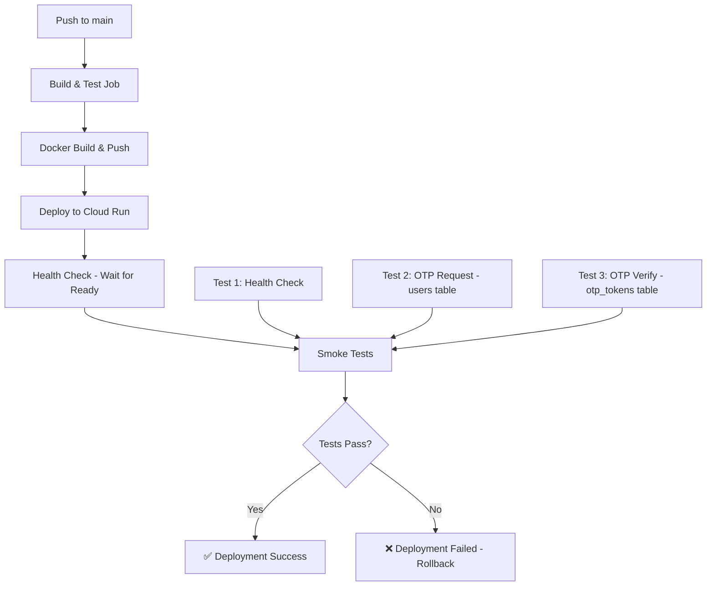

# API Testing Strategy for CI/CD Pipeline

This document explains the comprehensive testing approach integrated into the deployment pipeline.

## 🎯 Testing Strategy

### **Approach 1: Enhanced Smoke Tests (Currently Implemented)** ✅

**Location**: `.github/workflows/deploy-npe.yml` - "Run smoke tests" step

**What it tests:**
1. ✅ **Health Check** - Validates service is up and responding
2. ✅ **OTP Request** - Tests database connectivity to `users` table
3. ✅ **OTP Verification** - Tests `otp_tokens` and authentication flow
4. ✅ **JWT Token Generation** - Validates security and `roles` table access

**When it runs:**
- Automatically after every deployment to Cloud Run
- Deployment fails if any test fails
- Runs in ~30 seconds

**Benefits:**
- ✅ Catches database connectivity issues immediately
- ✅ Validates table name case sensitivity
- ✅ Tests critical authentication flow
- ✅ No additional infrastructure needed
- ✅ Fast feedback (part of deployment)

**How it works:**
```bash
# The workflow uses curl to test endpoints:
1. GET /actuator/health → Verify service is running
2. POST /api/auth/request-otp → Test users table access
3. POST /api/auth/verify-otp → Test otp_tokens table + authentication
4. Validates HTTP status codes and response structure
```

---

### **Approach 2: Java Integration Tests** 📝

**Location**: `src/test/java/com/fincore/usermgmt/integration/ApiIntegrationTest.java`

**What it tests:**
- All endpoints with proper assertions
- Database table accessibility (users, roles, permissions, otp_tokens)
- Authentication and authorization flows
- Invalid input handling
- Unauthorized access scenarios

**Run locally:**
```bash
mvn test -Dtest=ApiIntegrationTest
```

**Run in CI/CD:**
To enable in GitHub Actions, uncomment the test step in `.github/workflows/deploy-npe.yml`:

```yaml
- name: Run integration tests
  run: mvn test -Dtest=ApiIntegrationTest
  env:
    SPRING_PROFILES_ACTIVE: test
```

**Benefits:**
- ✅ More comprehensive test coverage
- ✅ Type-safe assertions with JUnit
- ✅ Better debugging with stack traces
- ✅ Can run locally before pushing

---

## 🚀 Current Deployment Flow



---

## 📊 What Gets Tested

### Database Tables Validated:
| Table | Test Method | When |
|-------|-------------|------|
| `users` | OTP Request endpoint | Every deployment |
| `otp_tokens` | OTP Verification | Every deployment |
| `roles` | User authentication response | Every deployment |
| `permissions` | Role-based access | Via integration tests |
| `address` | CRUD operations | Via integration tests |
| `organisation` | CRUD operations | Via integration tests |
| `kyc_documents` | CRUD operations | Via integration tests |

### Endpoints Tested:
- ✅ `GET /actuator/health` - Service health
- ✅ `POST /api/auth/request-otp` - Authentication initiation
- ✅ `POST /api/auth/verify-otp` - Token generation
- 📝 `GET /api/users` - User management (in Java tests)
- 📝 `GET /api/roles` - Role management (in Java tests)

---

## 🔍 Test Results Visibility

### In GitHub Actions:
1. Go to: https://github.com/kasisheraz/userManagementApi/actions
2. Click on the latest workflow run
3. Expand "Run smoke tests" step
4. You'll see:
   ```
   =========================================
   Test 1: Health Check
   =========================================
   ✅ Health check PASSED: UP
   
   =========================================
   Test 2: OTP Request (Database: users)
   =========================================
   ✅ OTP request PASSED (HTTP 200)
      Phone: +1234567890
      Dev OTP: 123456
   
   ... etc
   ```

### Via Cloud Run Logs:
```bash
gcloud run services logs read fincore-npe-api \
  --region=europe-west2 \
  --project=project-07a61357-b791-4255-a9e \
  --limit=50
```

---

## 🛡️ What This Prevents

### Before (No Tests):
- ❌ Database table name issues went undetected
- ❌ Service deployed but couldn't query tables
- ❌ Users experienced 500 errors
- ❌ Had to manually test after every deployment

### After (With Tests):
- ✅ **Case sensitivity issues detected immediately**
- ✅ **Deployment fails if database is inaccessible**
- ✅ **Authentication flow validated automatically**
- ✅ **No broken deployments reach production**

---

## 📈 Adding More Tests

### To add a new smoke test:

Edit `.github/workflows/deploy-npe.yml`:

```yaml
# Add after Test 3
echo ""
echo "========================================="
echo "Test 4: Get All Roles"
echo "========================================="
ROLES_RESPONSE=$(curl -s -w "\n%{http_code}" \
  -H "Authorization: Bearer $TOKEN" \
  $SERVICE_URL/api/roles)

HTTP_CODE=$(echo "$ROLES_RESPONSE" | tail -n1)
if [ "$HTTP_CODE" = "200" ]; then
  echo "✅ Roles endpoint PASSED"
else
  echo "❌ Roles endpoint FAILED"
  exit 1
fi
```

### To add a new integration test:

Add to `ApiIntegrationTest.java`:

```java
@Test
@Order(9)
@DisplayName("Get All Organisations - Should return organisation list")
void testGetAllOrganisations() {
    HttpHeaders headers = new HttpHeaders();
    headers.set("Authorization", "Bearer " + jwtToken);
    HttpEntity<String> entity = new HttpEntity<>(headers);

    ResponseEntity<String> response = restTemplate.exchange(
            baseUrl + "/api/organisations",
            HttpMethod.GET,
            entity,
            String.class
    );

    assertThat(response.getStatusCode()).isEqualTo(HttpStatus.OK);
}
```

---

## 🎓 Best Practices

1. **Keep smoke tests fast** - Should complete in < 1 minute
2. **Test critical paths only** - Focus on database connectivity and auth
3. **Use integration tests for comprehensive coverage** - Run locally or in nightly builds
4. **Monitor test results** - Set up notifications for failures
5. **Update tests when adding endpoints** - Keep tests in sync with API changes

---

## 🔧 Troubleshooting

### Test fails: "Table 'fincore_db.users' doesn't exist"
**Solution:** Re-import schema to `fincore_db` database:
```bash
# Upload complete-entity-schema.sql to Cloud Storage
# Import selecting 'fincore_db' as target database
```

### Test fails: "OTP verification failed"
**Check:**
- Is `SPRING_PROFILES_ACTIVE` set to include "npe"?
- Is `devOtp` field present in response?
- Check Cloud Run logs for errors

### Test fails: "Service health check timeout"
**Check:**
- Cloud Run logs for startup errors
- Database connection (Cloud SQL instance running?)
- Memory/CPU limits not exceeded

---

## 📚 Related Documentation

- [DEPLOYMENT_GUIDE.md](DEPLOYMENT_GUIDE.md) - Full deployment instructions
- [RUN_INSTRUCTIONS.md](RUN_INSTRUCTIONS.md) - Local development setup
- [POSTMAN_USAGE_GUIDE.md](POSTMAN_USAGE_GUIDE.md) - Manual API testing

---

## ✅ Summary

**Current Status:**
- ✅ Smoke tests run automatically after every deployment
- ✅ Critical database tables tested (users, otp_tokens, roles)
- ✅ Authentication flow validated
- ✅ Deployment fails fast if tests fail
- ✅ Integration test framework ready for expansion

**Next Steps:**
1. Monitor test results in GitHub Actions
2. Add more comprehensive tests as needed
3. Consider enabling integration tests in CI/CD
4. Set up Slack/email notifications for test failures
